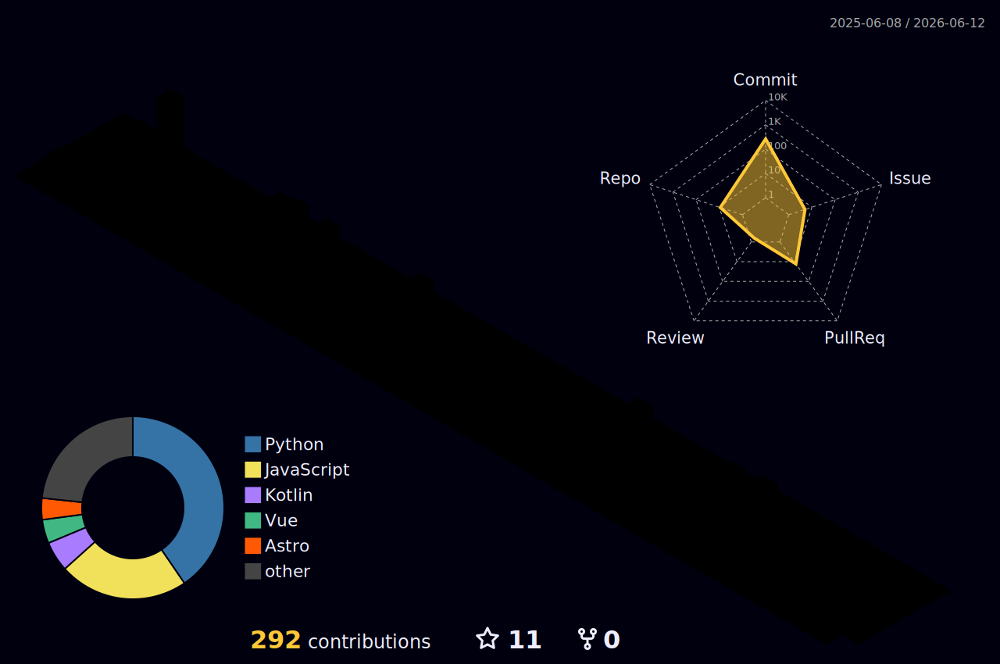
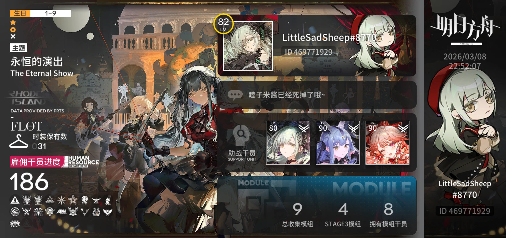

# (👉ﾟヮﾟ)👉 你好，我是LittleSadSheep！ 👈(ﾟヮﾟ👈)

> 💭 整天幻想项目完成，但从未真正完成过任何项目
> 
> 🎯 注意力难以集中，经常陷入白日梦
> 
> 📁 最擅长的技能是新建文件夹

  <!-- metrics 基础资料 -->
  

  <table border="0" align="right" width="280">
    <tr>
      <th></th>
    </tr>
    <tr>
      <td>
      放一块香香软软的草莓小蛋糕在这里……  
      

        没错！我是爱莉厨哈哈哈哈哈哈哈哈哈~
      
</td>
    </tr>
  </table>

  
  

  <!-- Snake Code Contribution Map 贪吃蛇代码贡献图 -->
  <picture>
    <source media="(prefers-color-scheme: dark)" srcset="./profile-snake-contrib/github-contribution-grid-snake-dark.svg" />
    <source media="(prefers-color-scheme: light)" srcset="./profile-snake-contrib/github-contribution-grid-snake.svg" />
    
  </picture>

<!-- GitHub Activity Graph GitHub 活动图 -->
<table>
  <tr>
    <td>
      <picture>
        <source media="(prefers-color-scheme: dark)" srcset="https://github-readme-activity-graph.vercel.app/graph?username=LittleSadSheep&theme=xcode&bg_color=FF000000&hide_border=true" />
        <source media="(prefers-color-scheme: light)" srcset="https://github-readme-activity-graph.vercel.app/graph?username=LittleSadSheep&theme=xcode&bg_color=FF000000&color=000000&hide_border=true" />
        
      </picture>
  </tr>
</table>

## 技能树 ψ(｀∇´)ψ

## 统计信息 (\*/ω\\*)

### **~~菜.jpg~~** 

 

<!--   -->
<!--  -->

 
 
 
 
 
 
 

  
点击展开 超——长——详——情——

  

  <!-- profile-3d-contrib 3D 贡献图-->
  <picture>
    <source media="(prefers-color-scheme: dark)" srcset="./profile-3d-contrib/profile-night-rainbow.svg" />
    <source media="(prefers-color-scheme: light)" srcset="./profile-3d-contrib/profile-gitblock.svg" />
    
  </picture>

  <!-- first form 第一个表格 -->
  <table>
    <tr>
      <td></td>
    </tr>
  </table>

  <!-- second form 第二个表格 -->
  <table>
    <tr>
      <td></td>
      <td></td>
    </tr>
    <tr>
      <td></td>
      <td></td>
    </tr>
    <tr>
      <td></td>
      <td></td>
    </tr>
    <tr>
      <td></td>
      <td></td>
    </tr>
    <tr>
      <td></td>
      <td></td>
    </tr>
    <tr>
      <td></td>
      <td></td>
    </tr>
  </table>

  
  

## 来找我玩吧 <(￣︶￣)↗[GO!]

&nbsp;&nbsp;&nbsp;
&nbsp;&nbsp;&nbsp;

 
 

 
 

[![genshin-image]][genshin-link]

## 近期博客 ☆*: .｡. o(≧▽≦)o .｡.:*☆

[genshin-image]: https://genshin-card.himiku.com/rand/302923755.png
[genshin-link]: https://enka.network/u/207525768

<!-- feed start -->
- Nov 30 - [Hyper-V + Linux GPU 加速：一场“硬件限制”与“驱动缺失”的双重夹击战](https://blog.sheepmc.top/posts/hyper-v--linux-gpu-%E5%8A%A0%E9%80%9F%E4%B8%80%E5%9C%BA%E7%A1%AC%E4%BB%B6%E9%99%90%E5%88%B6%E4%B8%8E%E9%A9%B1%E5%8A%A8%E7%BC%BA%E5%A4%B1%E7%9A%84%E5%8F%8C%E9%87%8D%E5%A4%B9%E5%87%BB%E6%88%98/)
- Nov 23 - [从选系统到装 Hyprland：一台游戏本的双系统“修行记”](https://blog.sheepmc.top/posts/%E4%BB%8E%E9%80%89%E7%B3%BB%E7%BB%9F%E5%88%B0%E8%A3%85-hyprland%E4%B8%80%E5%8F%B0%E6%B8%B8%E6%88%8F%E6%9C%AC%E7%9A%84%E5%8F%8C%E7%B3%BB%E7%BB%9F%E4%BF%AE%E8%A1%8C%E8%AE%B0/)
- Oct 12 - [让密码登录“先过 2FA”而私钥秒进：一份不说废话的 SSH 配置笔记](https://blog.sheepmc.top/posts/%E8%AE%A9%E5%AF%86%E7%A0%81%E7%99%BB%E5%BD%95%E5%85%88%E8%BF%87-2fa%E8%80%8C%E7%A7%81%E9%92%A5%E7%A7%92%E8%BF%9B%E4%B8%80%E4%BB%BD%E4%B8%8D%E8%AF%B4%E5%BA%9F%E8%AF%9D%E7%9A%84-ssh-%E9%85%8D%E7%BD%AE%E7%AC%94%E8%AE%B0/)
- Aug 21 - [当路由器开始“偷窥”：我是如何用 Hysteria2 让它彻底失明的](https://blog.sheepmc.top/posts/%E5%BD%93%E8%B7%AF%E7%94%B1%E5%99%A8%E5%BC%80%E5%A7%8B%E5%81%B7%E7%AA%A5%E6%88%91%E6%98%AF%E5%A6%82%E4%BD%95%E7%94%A8-hysteria2-%E8%AE%A9%E5%AE%83%E5%BD%BB%E5%BA%95%E5%A4%B1%E6%98%8E%E7%9A%84/)
- Aug 08 - [关于我在香港装了一条 1 Gbps 宽带，却差点被“回国带宽”气哭](https://blog.sheepmc.top/posts/%E5%85%B3%E4%BA%8E%E6%88%91%E5%9C%A8%E9%A6%99%E6%B8%AF%E8%A3%85%E4%BA%86%E4%B8%80%E6%9D%A11-gbps%E5%AE%BD%E5%B8%A6%E5%8D%B4%E5%B7%AE%E7%82%B9%E8%A2%AB%E5%9B%9E%E5%9B%BD%E5%B8%A6%E5%AE%BD%E6%B0%94%E5%93%AD/)
<!-- feed end -->
